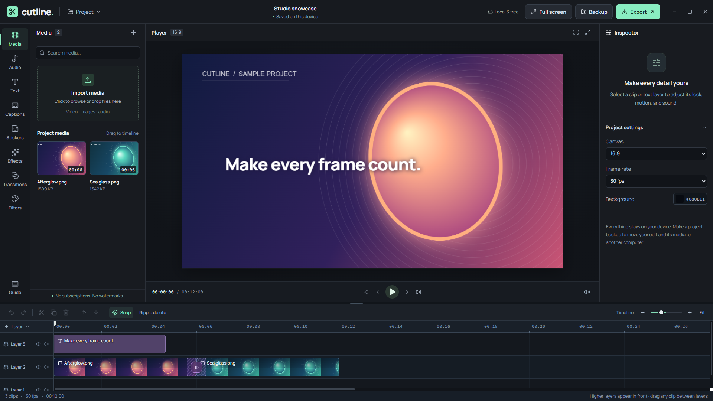
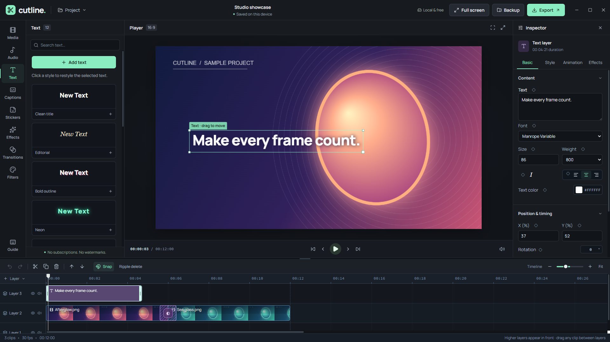
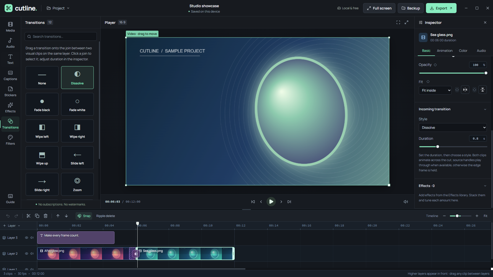

# Cutline 0.3.12

A free, device-local video editor for Windows and the web. No subscription, account in the PC app, or export watermark. The hosted development site uses its existing private Sites access policy. Source media is never uploaded by the editor.

## Screenshots

These are captures of the Windows editor with a synthetic sample project; no personal media is included.



*Editor overview — media library, preview, and layered timeline.*



*Text presets and editable styling controls.*



*Transitions span the cut between two clips; duration is adjustable in the inspector.*

## Editing

- Absolute-position universal-layer timeline with frame-aligned moves, cross-track dragging, marquee multi-selection and group moving/deleting, speed-aware trimming, snapping, horizontal/vertical edge scrolling, and adjustable timeline height/zoom.
- Split, duplicate, copy/paste at the playhead, delete, optional ripple delete, grouped undo/redo, and Escape to cancel a drag.
- One canvas renderer shared by preview and export, with local video/image/audio import and independent players for duplicate source clips.
- 12 adjustable, stackable effects; 12 incoming transitions; 12 color looks; brightness, contrast, saturation, and temperature.
- 12 text presets, six font choices, outlines, shadows/glow, backgrounds, spacing, rotation, opacity, and alignment. Text and visual clips support independently tunable entrance/exit animation stacks: combine Drift, Zoom, Wipe, Fade, and other presets at once, then tune each layer's direction/angle, distance, zoom in or out, rotation, blur, fade, and easing. Name and save an entire stack for reuse. Saved recipes live on each device; applying one copies its settings into the project, including backups.
- Per-property keyframe diamonds for video transform/color/effects/audio and text appearance/effects, plus legacy motion keyframes. Keyframed preview and export share the same renderer.
- Optional, free on-device OpenAI Whisper Tiny auto subtitles (model download requires confirmation), SRT import, manual captions, editable symbol stickers, real audio waveforms, gain, fade-in/out and track mute/hide.
- Autosaved projects with retained project history, portable `.cutline` backups containing imported media, and legacy project migration. The desktop waits for a save before closing.
- Browser-supported MP4/H.264 or WebM/VP9/VP8 export, 720p/1080p/2160p, 30/60 fps, native save dialogs, and immediate cancellation.

Transitions are edited on the incoming clip but span both sides of the cut, animating the outgoing and incoming video together. Duration can be set before choosing a transition style. Dissolve, Zoom, Blur, and Glitch smoothly fade out the outgoing visual even when the incoming image has transparent areas. Embedded video audio crossfades over the same window. Available source handles play through; without handles the edge frame is held. Overlapping video clips on the same track use the later-starting clip; put concurrent layers on separate tracks. Higher-numbered video tracks render above Main. Audio clips may overlap and mix.

Imported stills fit inside the canvas by default; existing stills using the former automatic fill setting are corrected when loaded. A manually selected fill setting is retained. Selection handles follow the visible fitted image, and filled media is cropped to its selection frame.

## Limits

This is not a complete CapCut replacement. Tracking, advanced masking, optical-flow retiming, proxy editing, and GPU/offline render pipelines are not included. Auto subtitles require a first-time model download and may need correction, especially with noisy or overlapping speech. Export is real-time using Canvas, Web Audio and MediaRecorder. Keep the window open and the computer awake. Long edits, 4K/60 fps and stacked effects can consume substantial memory or drop frames; 1080p/30 fps is the practical starting point. Backups larger than 1 GB are rejected. Source codec support depends on the browser/Electron build.

Web projects and PC projects use separate local storage. Transfer edits using a `.cutline` backup. Clearing browser/app data can remove local projects; keep backups of important work. Imported source files themselves are never modified.

The Windows release is unsigned. It is not installed automatically and may trigger a Windows publisher warning.

## Development

Node.js >=22.13.0 and npm are required.

```sh
npm install
npm run dev
npm run typecheck
npm run lint
npm test
npm run desktop:dist
```

`desktop:dist` emits the Windows x64 installer and portable executable into `outputs/desktop`. Electron uses an isolated, sandboxed preload bridge; Node.js is not exposed to the UI.

`test:unit` runs model/history tests and isolated React timeline interaction tests. `test:engine` tests actual Canvas rendering, IndexedDB preservation, all available encoders, audio, cancellation and duplicate source playback in an isolated Electron profile. `npm test` also builds and checks the server-rendered shell. Tests never use the user's normal project profile.

## Verification for this release

31 model/component checks and the rendering/export suite passed, including image fit and selection bounds, an editable transition duration, a smooth transparent-image crossfade, two-sided visual transitions before and after the cut, both imported-video source handles, embedded-audio crossfade, and matching preview/export renders. The rendering suite exercised every effect, look, transition and text preset, verified playable 720p MP4 and WebM outputs with audio, and decoded audio from a real exported MP4 for Whisper. Type checking passed. The Windows package and server-rendered shell are checked during release packaging.

Interactive native screenshot/pointer QA could not be completed: the Windows capture helper returned `SetIsBorderRequired failed: No such interface supported (0x80004002)` and pointer actions lacked capture geometry. The timeline component tests simulate pointer events and verify exact clip state/position; they are not a substitute for broad human/device testing. 4K/60 fps and long-project performance are not certified.
